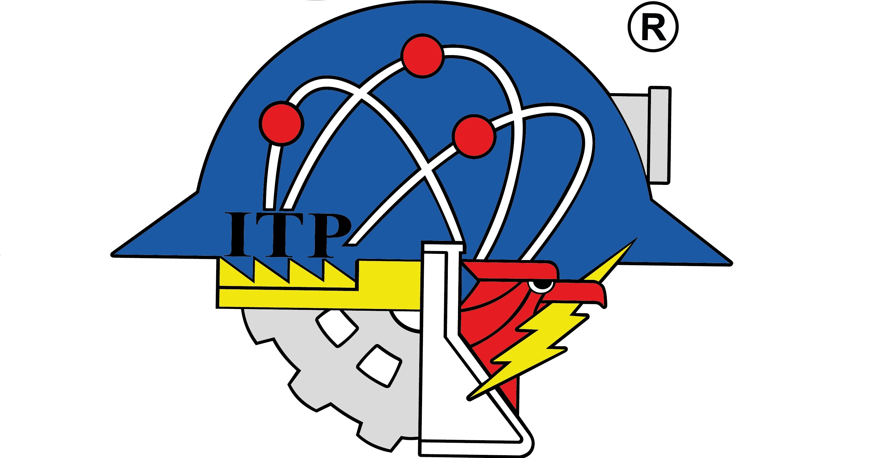

  
  

<h1 align="center">INSTITUTO TECNOLÓGICO DE PACHUCA</h1>

<h2 align="center">Ingeniería en Tecnologías de la Información y Comunicaciones</h2>

<h2 align="center">Taller de Desarrollo de Software</h2>

<h3 align="center">Práctica: Clase 18, 19 - webApi (apiRESTCheckUsuarioTADS) </h3>
<h3 align="center">Descripción: </h3>
<h4 align="left"> Creación de endpoints:  </h4>
<h4 align="left"> - Registro de usuario: tads/usuario/spinsusuario</h4>
<h4 align="left">- Validar accesos: tads/usuario/spvalidaracceso</h4>
<h4 align="left">- Consultar usuarios: tads/usuario/vwrptusuario</h4>
<h4 align="left">- Consultar tipos de usuarios: tads/usuario/vwtipousuario</h4>
<h4 align="left">Usando métodos HTTPS para su ejecución.</h4>
<h3 align="center">Catedrático: M.T.I. LUIS ALEJANDRO SANTANA VALADEZ</h3>
<h3 align="center"> Autor: Maricruz Pineda Lara</h3>
<h3 align="center"> 8° "A"</h3>
<h3 align="right">Fecha: 11 marzo 2026</h3>
